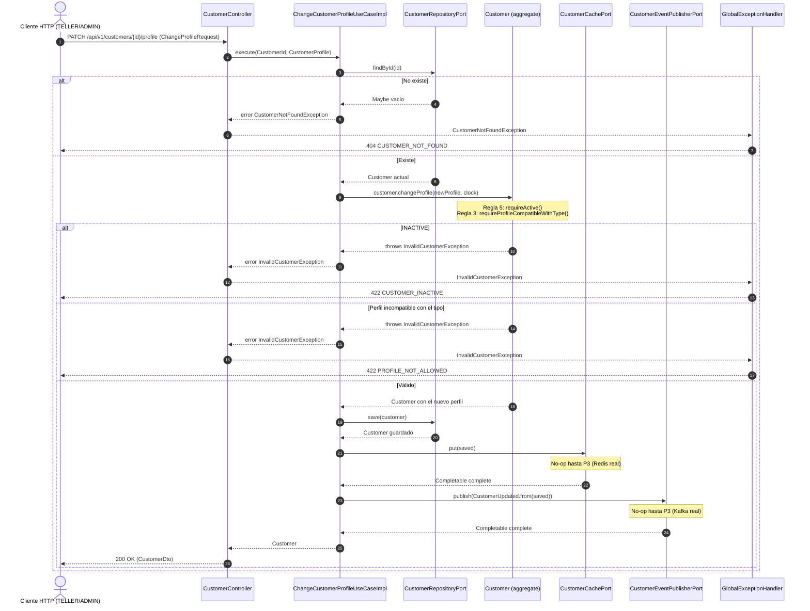

# Secuencia — Cambiar perfil (`PATCH /customers/{id}/profile`)

Implementado en `ChangeCustomerProfileUseCaseImpl` (R3) + `CustomerController` /
`GlobalExceptionHandler` (R5). No hay caso de uso separado para consultar: reutiliza
`findById` del puerto de salida.

## Notas

- El documento y el tipo **nunca** cambian aquí: solo `profile` y `updatedAt`. `update` (nombre y
  contacto) es un caso de uso distinto (`UpdateCustomerUseCaseImpl`) con la misma forma de guarda
  (`requireActive`) pero sin la validación de perfil.
- El orden de las dos validaciones dentro de `Customer.changeProfile` es `requireActive()` primero;
  por eso un cliente `INACTIVE` con un perfil también incompatible responde `CUSTOMER_INACTIVE`,
  no `PROFILE_NOT_ALLOWED`.
