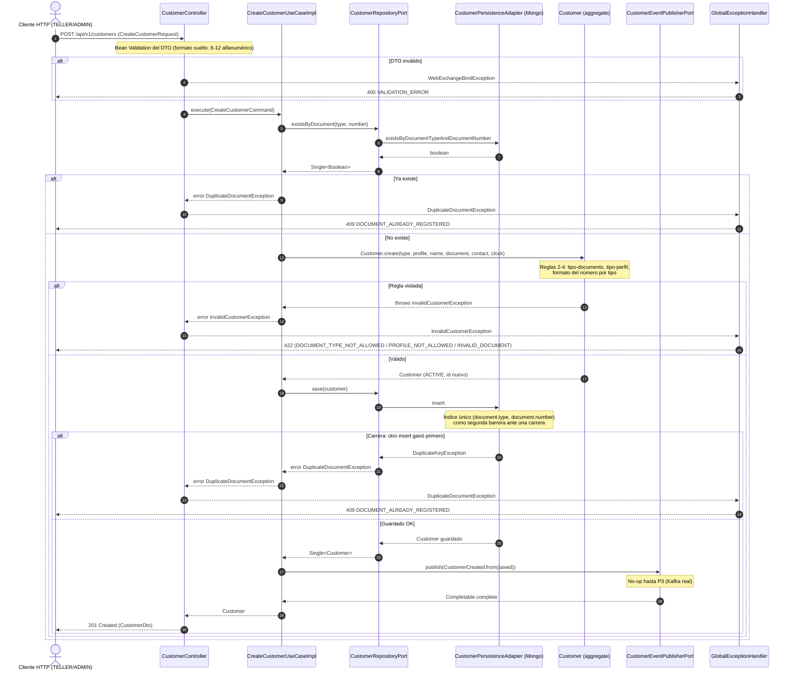

# Secuencia — Crear cliente (`POST /customers`)

Cubre validación, duplicado, guardado y publicación del evento, tal como está implementado en
`CreateCustomerUseCaseImpl` (R3) + `CustomerPersistenceAdapter` (R4) + `CustomerController` /
`GlobalExceptionHandler` (R5).

## Notas

- La verificación de duplicado en dos pasos (`existsByDocument` antes de `create`, e índice único
  de Mongo como respaldo) es intencional: la primera evita construir el aggregate innecesariamente
  en el caso normal; la segunda cubre la carrera entre dos peticiones concurrentes con el mismo
  documento, algo que una sola consulta previa no puede garantizar.
- `Customer.create(...)` es una llamada síncrona que puede lanzar una excepción de dominio; se
  envuelve en `Single.fromCallable(...)` para que ese error entre al canal reactivo de errores en
  vez de propagarse como una excepción no controlada antes de construir la cadena (ver R3).
- El publicador de eventos es un adaptador *no-op* hasta P3: hoy no hay Kafka real, pero el punto
  de extensión ya existe en el caso de uso.
