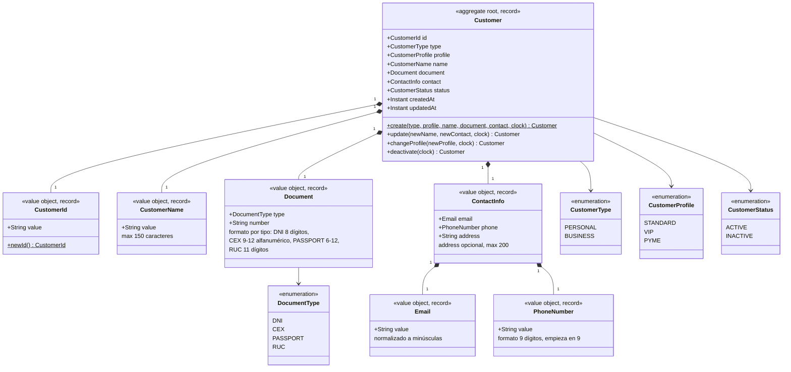

# UML de dominio — `customer-service`

Aggregate `Customer` (Java record, inmutable) con sus value objects y enums. Todo en
`domain/model`, sin dependencias de Spring.

## Invariantes que vive el aggregate (no el mapper ni el controller)

| # | Regla | Dónde se aplica |
|---|---|---|
| 2 | El tipo de documento debe ser coherente con el tipo de cliente (`PERSONAL` → DNI/CEX/PASSPORT, `BUSINESS` → RUC) | `Customer.create` → `InvalidCustomerException("DOCUMENT_TYPE_NOT_ALLOWED")` |
| 3 | El perfil debe ser compatible con el tipo (`VIP` solo `PERSONAL`, `PYME` solo `BUSINESS`, `STANDARD` ambos) | `Customer.create` y `Customer.changeProfile` → `InvalidCustomerException("PROFILE_NOT_ALLOWED")` |
| 4 | El número de documento debe cumplir el formato de su tipo | Constructor compacto de `Document` → `InvalidCustomerException("INVALID_DOCUMENT")` |
| 5 | Un cliente `INACTIVE` no admite `update` ni `changeProfile` | `Customer.requireActive()` → `InvalidCustomerException("CUSTOMER_INACTIVE")` |
| 7 | La baja es lógica e idempotente: repetirla sobre un `INACTIVE` no cambia nada ni vuelve a publicar el evento | `Customer.deactivate` + `DeleteCustomerUseCaseImpl` |

La unicidad del documento (regla 1) **no** vive en el aggregate: se resuelve en el caso de uso
(`existsByDocument`) y se refuerza con el índice único de Mongo — ver el diagrama de secuencia
de creación.
